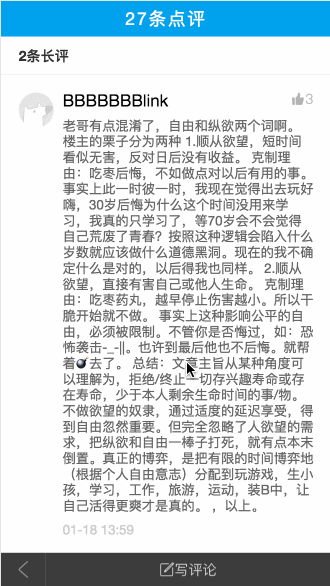
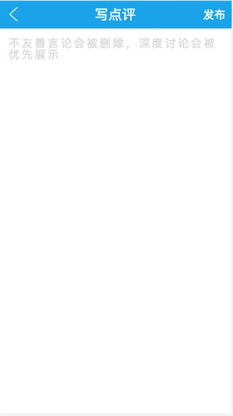
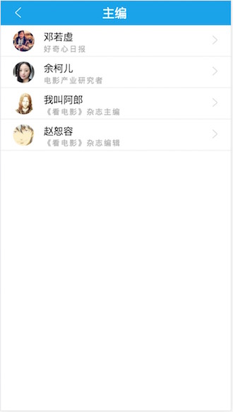
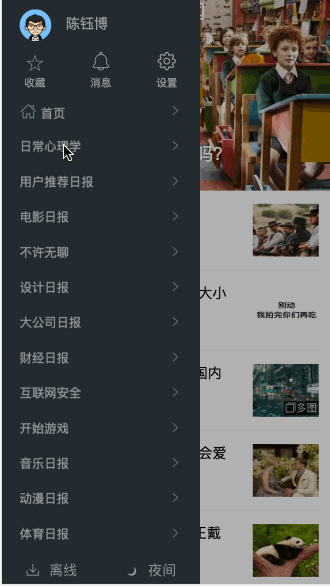

# vue-zhihu-daily
> 这是一个基于Vue全家桶开发的知乎日报WebApp，页面样式主要参考iOS版知乎日报APP。

> 个人博客：[陈钰博的博客](http://www.chenyubo.me)

> 项目github地址：[vue-zhihu-daily](https://github.com/cccyb/vue-zhihu-daily)

> 如果觉得对您有帮助，您可以点右上角给个 star 支持一下，十分感谢！如果有问题，也欢迎提交 issue 一起探讨!

## 声明
>『知乎』是 知乎. Inc 的注册商标。本软件与其代码非由知乎创作或维护。软件中所包含的信息与内容皆违反版权与知乎用户协议。本项目所有文字图片等稿件内容均由[知乎](https://www.zhihu.com)提供，获取与共享之行为或有侵犯知乎权益的嫌疑。若被告知需停止共享与使用，本人会及时删除整个项目。请您了解相关情况，并遵守知乎协议。

## 前言
前段时间抽空学习了Vue，并跟着慕课网的黄轶老师[@ustbhuangyi](https://github.com/ustbhuangyi)完成了第一个Vue小demo[Vue高仿饿了么APP](https://github.com/cccyb/vue-eleme-app)。通过这个小demo，对Vue的开发有了一个初步的认识，然而这个demo是跟着老师的视频敲的代码，所以为了更好的学习Vue，就萌生了完整的写一个复杂webApp的想法，有了想法，就开始干呗。

为什么是知乎日报呢？

- 首先呢，知乎日报是一个完整的已经上线的APP，并且它的功能比较完善，但是页面还不是很复杂，比较适合新手练手。
- 其次，由于开发的是前端项目，数据获取是一个比较恼火的问题，然而github上已经有大神给出了[知乎日报 API 分析](https://github.com/izzyleung/ZhihuDailyPurify/wiki/%E7%9F%A5%E4%B9%8E%E6%97%A5%E6%8A%A5-API-%E5%88%86%E6%9E%90)，这极大的方便的解决了数据的获取问题，我们只需关注前端，而不需关注后台数据。

## 技术栈
vue2 + vue-router + axios + vuex + vue-cli 
mint-ui + sass + flex + eslint

## 在线Demo
[点我在线预览](http://112.74.200.85:8888)

**（PC端建议开启Chrome手机调试模式食用更佳，移动端直接在浏览器开启即可）**

## 功能
- [x] 首页
- [x] 启动欢迎页
- [x] 首页滚动到底部加载更多
- [x] 查看新闻详情
- [x] 新闻详情页载入下一篇
- [x] 收藏新闻
- [x] 查看评论
- [x] 短评展开和收缩
- [x] 编写评论页（不能发送到后台）
- [x] 侧边栏
- [x] 查看指定主题新闻
- [x] 查看指定主题下的编辑列表
- [x] 查看某个编辑的个人信息
- [x] 查看收藏新闻

## 项目截图
### 首页


### 新闻详情页


### 评论查看页


### 编写评论页


### 主题页


### 编辑列表页


### 编辑个人详情页


###  收藏页


## 项目运行
```bash
# 克隆项目到本地
git clone https://github.com/cccyb/vue-zhihu-daily.git

# 切换到项目所在文件夹
cd vue-zhihu-daily

# 安装依赖
npm install

# 本地开发，开启服务器，浏览器访问 http://localhost:8088即可
npm run dev

# 构建生产
npm run build

```
## 目录结构
```
.
|-- build					// webpack配置文件
|-- config					// 项目打包路径
|-- dist					// 项目部署文件，放在服务器即可正常访问
|-- src						// 源码目录
|	|-- assets				// 资源目录
|	|	|-- images			// 图片目录
|	|	|-- sass			// sass目录
|	|		|-- components		// 组件sass目录
|	|		|-- pages		// 页面sass目录
|	|-- components				// 组件
|	|	|-- LongComment.vue		// 长评组件
|	|	|-- NewsList.vue		// 新闻列表组件
|	|	|-- NewsMenu.vue		// 新闻详情底部菜单组件
|	|	|-- Share.vue			// 新闻详情分享弹框组件
|	|	|-- ShortComment.vue		// 短评组件
|	|	|-- Sidebar.vue			// 侧边栏组件
|	|	|-- Swipe.vue			// 轮播图组件
|	|-- pages				// 页面
|	|	|-- Collect.vue			// 收藏页面
|	|	|-- Comment.vue			// 评论页面
|	|	|-- Editor.vue			// 查看编辑个人信息页面
|	|	|-- EditorList.vue		// 编辑列表页面
|	|	|-- Index.vue			// 首页
|	|	|-- NewsDetail.vue		// 新闻详情页面
|	|	|-- ThemeDetail.vue		// 主题页面
|	|	|-- WriteCommnet.vue		// 编写评论页面
|	|-- router
|	|	|-- index.js			// 路由配置
|	|-- store
|	|	|-- index.js			// vuex配置
|	|	|-- actions.js		// actions
|	|	|-- getters.js		// getters
|	|	|-- mutation-types.js	// mutation常量
|	|	|-- mutations.js		// mutation
|	|	|-- state.js			// state
|	|-- App.vue				// 页面入口文件
|	|-- main.js				// 程序入口文件，加载各种公共组件
|-- static					// 静态文件目录
|	|-- css
|	|	|-- animate.css			// 动画css
|	|	|-- iconfont.css		// 图标字体css
|	|	|-- icontont.ttf		// 图标字体ttf
|	|	|-- iconfont.woff		// 图标字体woff
|	|	|-- news_qa_auto.css		// 页面详情内容css
|	|	|-- reset.css			// 统一浏览器样式css
|-- .babelrc					// ES6语法编译配置
|-- .editorconfig				// 代码编写规格配置
|-- .eslintignore				// 忽略eslint检查文件配置
|-- .eslint.js					// eslint配置文件
|-- .gitattributes				// 修改项目在github显示类型配置文件
|-- .gitignore					// git忽略上传文件
|-- .postcssrc.js
|-- index.html					// 入口html文件
|-- package.json				// 项目及工具的依赖配置文件
|-- README.md					// readme说明
|-- yarn.lock					// yarn文件
.
```
## Todo
- [x] ~~启动欢迎页~~
- [ ] 首页新闻时间分隔栏
- [ ] 首页头部上滑颜色渐变效果
- [x] ~~首页下拉刷新~~
- [ ] 消息页面
- [ ] 设置页面
- [ ] 个人信息页面
- [ ] 离线
- [ ] 夜间模式
- [ ] 整体代码重构，性能优化
- [ ] 移动端1px边框优化
- [x] ~~侧边栏主题列表滚动效果~~
- [x] ~~图片懒加载~~
- [ ] 页面切换动画
- [ ] 手势侧滑功能
- [x] ~~vuex状态管理文件重构优化~~
- [ ] 浏览器兼容性
- [x] ~~生产环境部署~~
- [ ] 流程跳转优化
- [ ] localStorage
- ...

## ChangeLog
见	[ChangeLog](./CHANGELOG.md)

## 总结
### 1.知乎接口跨域问题（开发环境）
调用知乎API时遇到了跨域问题，但是知乎的接口好像不支持jsonp，谷歌一波发现可以使用vue-cli自带的config的proxyTable文件配置进行解决，配置非常简单：
	
```js
proxyTable: {
 '/api': {
    target: 'http://news-at.zhihu.com',
    changeOrigin: true,
    pathRewrite: {
      '^/api': '/api/4'
    }
  }
}
```
此时请求`api/xxx`将会代理成`http://news-at.zhihu.com/api/4/xxx`
这样就不会有跨域问题了，当然这只适用于开发环境。
### 2.项目部署以及解决跨域问题（生产环境）
想要在生产环境里解决跨域问题，可以选择使用后台服务器中转API来完成跨域，具体可以选择Node或者Nginx来解决。

本项目已部署至阿里云服务器，使用Nginx进行代理，详情见[阿里云服务器部署Vue项目总结](http://chenyubo.me/2017/04/02/deploy-vue-project-to-aliyun/)

### 3.图片防盗链问题
知乎API返回的数据中的图片都是存储在知乎服务器上的url地址，直接请求会返回403，所以需要进行一些处理，这里我采用了[yatessss](https://github.com/yatessss)同学在[使用vue完成知乎日报web版](http://www.yatessss.com/2016/07/08/%E4%BD%BF%E7%94%A8vue%E5%AE%8C%E6%88%90%E7%9F%A5%E4%B9%8E%E6%97%A5%E6%8A%A5web%E7%89%88.html)的解决方案，使用[Images.weserv.nl](https://images.weserv.nl)进行缓存图片，并在需要使用图片url的地方进行相应的替换。

### ...

## 参考
> 感谢[izzyleung](https://github.com/izzyleung) 整理的 [知乎日报API分析](https://github.com/izzyleung/ZhihuDailyPurify/wiki/%E7%9F%A5%E4%B9%8E%E6%97%A5%E6%8A%A5-API-%E5%88%86%E6%9E%90)

> [使用vue完成知乎日报web版](http://www.yatessss.com/2016/07/08/%E4%BD%BF%E7%94%A8vue%E5%AE%8C%E6%88%90%E7%9F%A5%E4%B9%8E%E6%97%A5%E6%8A%A5web%E7%89%88.html) By [yatessss](https://github.com/yatessss) 

## License
[MIT](http://opensource.org/licenses/MIT)

